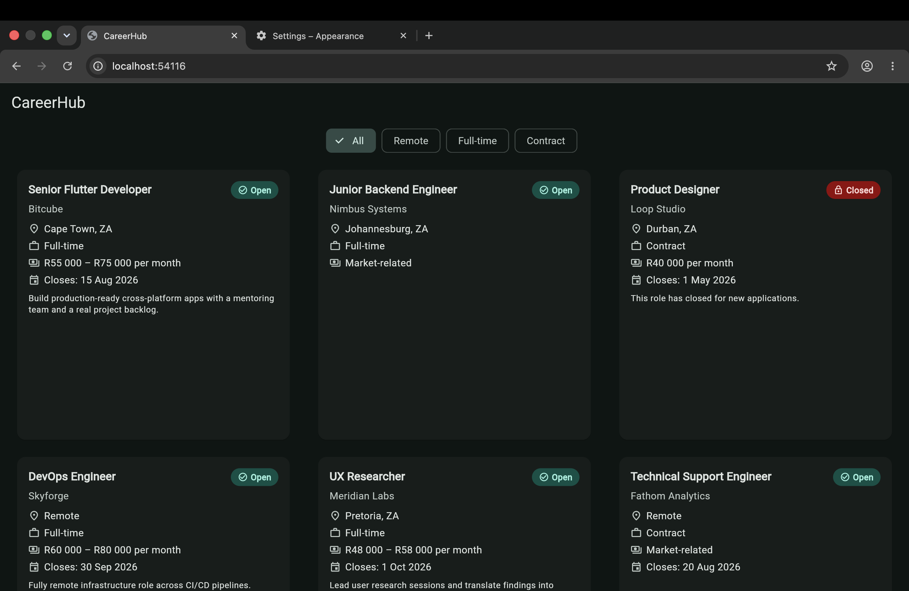

# CareerHub — Assignment 1.1: The Job Model & First Widget

Week 1, Day 1. This README contains all written decisions (Part 1), the
scratch output (Part 2), manual verification notes (Part 3), and the colour
justification (Part 4).

---

## PART 1 — WRITTEN DECISIONS

### Question 1 — Nullability decisions

| Field | Decision | Domain justification |
|---|---|---|
| `title` | **Non-nullable** | A listing with no title is not something a seeker could browse or apply to — a job is defined by the role it names. |
| `company` | **Non-nullable** | An anonymous employer is not a credible listing on a career platform; the hiring company is always known to the poster. |
| `location` | **Non-nullable** | Every role is performed somewhere — including "Remote" — and location is the first thing a seeker uses to judge fit. |
| `salary` | **Nullable** | An employer may choose not to disclose salary, so a listing can legitimately exist without one. |
| `closingDate` | **Nullable** | Many roles stay open until filled and never carry a fixed deadline, so a listing without one is normal. |
| `description` | **Nullable** | Draft listings are created before the full description is written, so the field may legitimately be empty at creation. |
| `employmentType` | **Non-nullable** | The nature of the engagement (full-time, contract, etc.) is always something the employer knows and the seeker needs to decide. |
| `isOpen` | **Non-nullable** | Every listing is definitively either accepting applications or not — there is no "unknown" state — so it is always present (defaulting to open). |

**Most dangerous nullable field to render without a null check:** `salary`.
If `closingDate` is forgotten you get an awkward "Closes: " with nothing after
it — ugly, but harmless. If `salary` is rendered directly without a null
check, the card literally displays the word **"null"** in the salary slot. A
job seeker scanning listings would read "null" as the pay — it looks broken,
untrustworthy, and could make them skip a real opportunity or doubt the whole
platform. That is why `displaySalary` exists and is the only path the UI uses:
it converts an absent salary into "Market-related" so "null" can never reach
the screen.

### Question 2 — The salary type decision

**Chosen type: `String?`**

The CareerHub API almost certainly returns salary as a **string**, not a raw
number. Backends that model money for display commonly send a pre-formatted
range like `"R30 000 – R45 000 per month"` because salary is frequently a
*range* with a *period* and a *currency*, none of which a single `int` or
`double` can carry. A number would also force the frontend to reinvent
currency and range formatting the backend already knows. On screen the user
sees exactly that human-readable string, so storing it as a string means no
lossy conversion. It is nullable (`String?`) so the **confidential-salary**
case is represented honestly by `null` — not by a magic value like `0` or
`-1` that sorting and display logic would have to special-case. When salary is
confidential, the model holds `null` and `displaySalary` returns
"Market-related". (The one trade-off — sorting by pay — is a Week-2+ concern
that would use a separate numeric `salaryMin` field rather than parsing the
display string.)

### Question 3 — Status representation

**Chosen: a `bool isOpen` field.**

**Main limitation:** a boolean can only model two states — open or not-open —
but a real listing has **four** (Active, Closed, Draft, Expired). "Closed",
"Draft", and "Expired" all collapse into `isOpen == false`, so the model
cannot tell them apart, and the UI can't show *why* a job isn't accepting
applications.

**Week 2 Day 2 feature that fixes this: `enum` (Dart enums / enhanced enums).**
An `enum JobStatus { active, closed, draft, expired }` is better because it
makes all four states explicit and mutually exclusive, lets the compiler force
every `switch` to handle each case, and removes the ambiguity of a single
boolean.

### Question 4 — Named constructor justification

- **`Job.closed(...)`** — a role whose deadline has passed or has been filled
  must be preserved for the record but locked against new applications; the
  default constructor defaults `isOpen` to `true`, so it cannot *guarantee*
  this closed state the way a dedicated constructor that hard-sets
  `isOpen = false` does.
- **`Job.remote(...)`** — a fully remote role has no physical office, so this
  constructor encapsulates the domain state by intrinsically stamping
  `location = 'Remote'`, removing the chance of an inconsistent free-text
  location and expressing "this job is remote" as a first-class creation path.

---

## PART 2 — SCRATCH OUTPUT

Run with: `dart run scratch/scratch.dart`

Expected output (deterministic):

```
=== PART 2: Four job variants ===

Job 1: Job(title: Senior Flutter Developer, company: Bitcube, location: Cape Town, ZA, salary: R55 000 – R75 000 per month, employmentType: Full-time, closingDate: 2026-08-15T00:00:00.000, isOpen: true, canApply: true)
   canApply      -> true
   displaySalary -> R55 000 – R75 000 per month

Job 2: Job(title: Junior Backend Engineer, company: Nimbus Systems, location: Johannesburg, ZA, salary: —, employmentType: Full-time, closingDate: —, isOpen: true, canApply: true)
   canApply      -> true
   displaySalary -> Market-related

Job 3: Job(title: Product Designer, company: Loop Studio, location: Durban, ZA, salary: R40 000 per month, employmentType: Contract, closingDate: 2026-05-01T00:00:00.000, isOpen: false, canApply: false)
   canApply      -> false
   displaySalary -> R40 000 per month

Job 4: Job(title: DevOps Engineer, company: Skyforge, location: Remote, salary: R60 000 – R80 000 per month, employmentType: Full-time, closingDate: —, isOpen: true, canApply: true)
   canApply      -> true
   displaySalary -> R60 000 – R80 000 per month

=== STRETCH A: copyWith ===

Original job3 canApply: false
reopened  copy canApply: true
job1.copyWith() same title: true

=== STRETCH B: matches() test ===

matches("cape town") -> 2 results (expected 2) PASS
     - Flutter Developer @ Bitcube (Cape Town)
     - Backend Developer @ Skyforge (Cape Town)
matches("bitcube") -> 2 results (expected 2) PASS
     - Flutter Developer @ Bitcube (Cape Town)
     - DevOps Lead @ Bitcube (Remote)
matches("developer") -> 2 results (expected 2) PASS
     - Flutter Developer @ Bitcube (Cape Town)
     - Backend Developer @ Skyforge (Cape Town)

All assertions run.
```

This demonstrates the required behaviour:
- `canApply` is **false** for the closed job (job 3) and **true** for the open jobs.
- `displaySalary` returns the formatted salary for job 1 and **"Market-related"** for job 2.
- `toString()` produces readable output for all four.

---

## PART 3 — JOBCARD MANUAL VERIFICATION

Render all four jobs in `HomeScreen`. Verified:

- ✅ The no-salary job (job 2) shows **"Market-related"** — not "null", not a blank line.
- ✅ The no-closing-date job (job 2) shows **no** closing-date label — not "null", not "Closes: " (collection-if removes the row entirely).
- ✅ The closed job (job 3) shows a red **"Closed"** badge; open jobs show a **"Open"** badge — distinguishable at a glance.
- ✅ The remote job (job 4) renders location as **"Remote"**.
- ✅ Toggling a job's `isOpen` in the hardcoded list and pressing **hot reload** updates the badge without restarting the app (`HomeScreen` is stateless and rebuilds on reload).

---

## PART 4 — COLOUR CHOICE

Seed colour: **deep teal `#00695C`**. I picked teal because it reads as
trustworthy, calm, and professional without falling back on the default
corporate blue — appropriate for a platform people rely on for their
livelihood.

---

## STRETCH GOALS (Assignment 1.1)

- **Stretch A — `copyWith`:** implemented on `Job`. It solves the problem that
  updating one field otherwise means retyping *every* argument to `Job(...)`,
  which is verbose and error-prone; `copyWith` returns a new immutable Job with
  just the changed fields replaced. This is auto-generated by the **`freezed`**
  package (Week 2 Day 2).
- **Stretch B — `matches`:** implemented + tested in the scratch file (output above).
- **Stretch C — `JobStatusBadge`:** extracted into `lib/widgets/job_status_badge.dart`.
  Worthwhile because it gives the open/closed visual language a single
  definition reused everywhere, so styling changes happen in one file instead
  of being duplicated across every card and screen.

---
---

# CareerHub — Assignment 1.2: The Responsive List & Adaptive Theme

Week 1, Day 2. Builds directly on the Assignment 1.1 submission above — the
`Job` model, `JobCard`, and `JobStatusBadge` are unchanged in shape. This
assignment makes every layout and colour choice around them deliberate
across screen sizes, theme modes, and data scale.

## PART 1 — WRITTEN DECISIONS

### Question 1 — Why the naive `Column` + `ListView.builder` crashes

`Scaffold.body` hands its child a **bounded** height constraint — finite,
capped at whatever vertical space is left after the app bar. Inside a
`Column`, though, every non-flexible child (anything not wrapped in
`Expanded` or `Flexible`) is handed **unbounded** height along the main
axis, because `Column` has to measure its fixed-size children first,
before it can work out how much room is left for flexible ones. The chip
row doesn't mind — a `SingleChildScrollView` just takes its own intrinsic
height regardless of the bound it's offered. But `ListView.builder` is a
scrolling *viewport*, and a viewport cannot lay itself out against an
infinite constraint — it needs a finite "window" to render into and
manage scroll position within. Handed unbounded height, it throws
(*"Vertical viewport was given unbounded height"*) and the app crashes
before it ever reaches the emulator screen.

**The fix:** wrap `ListView.builder` (or, here, the whole scrollable
content area) in `Expanded`. That forces `Column` to hand it the
*bounded* space left over once the chip row has been measured — exactly
the finite constraint the viewport needs. Implemented in
`home_screen.dart`.

### Question 2 — The grid cell problem

**2a — Content inventory.**

| Field | Always rendered? |
|---|---|
| Title + status badge | Required |
| Company | Required |
| Location (icon line) | Required |
| Employment type (icon line) | Required |
| Salary (icon line, via `displaySalary`) | Required — always renders *something*, even if just "Market-related" |
| Closing date (icon line) | Conditional — only if `closingDate != null` |
| Description | Conditional — only if `description` is non-null and non-empty |

**Minimum height estimate** (required fields only — job 2 in the list is
exactly this case): title + badge row (~28), company (~20), three icon
lines (~22 each = 66), card padding (16 top + 16 bottom = 32), inter-row
spacing (~26 total) ≈ **~170 screen units**.

**Maximum height estimate** (every field present, a two-line
description — job 1 or job 4): minimum + closing-date line (~26 with its
spacing) + description block (~8 spacing + ~32 for two lines of
`bodySmall`) ≈ **~240 screen units**.

**2b — `childAspectRatio` derivation.**

The grid only ever renders at width ≥ 600px — that's Part 4's own
breakpoint — so 600px, not a generic phone width, is the correct *worst
case* to design for: it's the narrowest the grid cell will ever actually
be, since above 600 the available width only grows. At exactly 600px,
with `padding: EdgeInsets.all(8)` and `crossAxisSpacing: 8` across 2
columns:

```
cell width = (600 − 8×2 − 8) / 2 = 576 / 2 = 288px
```

Using the maximum content estimate (240) as the height to design for
(see 2c for why max, not min):

```
childAspectRatio = width / height = 288 / 240 = 1.2
```

**childAspectRatio: 1.2** for the two-column grid.

**2c — What happens if you size for the minimum card instead.**

A fully populated card rendered inside a cell sized for the *minimal*
card overflows the fixed cell height: Flutter clips the extra content
and paints the classic yellow-and-black striped "RenderFlex overflowed
by N pixels" warning along the bottom edge. That's not acceptable — it
hides real information (the closing date, the description) from a job
seeker who might specifically need it, and a visibly broken card
undermines trust in the whole listing. The correct approach — what's
implemented here — is to size the aspect ratio for the **maximum**
content case. The tradeoff is some empty space at the bottom of minimal
cards: a cosmetic cost, not a functional one, and clearly preferable to
clipped content.

### Question 3 — Dark mode breakage audit

**Result: zero hardcoded colours found in either widget.** Both
`JobCard` and `JobStatusBadge` used `Theme.of(context).colorScheme` and
`Theme.of(context).textTheme` exclusively from Assignment 1.1 onward, so
neither required a single colour change for dark mode. The roles already
in use:

| Element | Role used | Why it's semantically correct |
|---|---|---|
| Job title | `textTheme.titleMedium` | The card's primary heading — the M3 scale's medium title role, not an arbitrary font size. |
| Company name | `textTheme.bodyMedium` + `colorScheme.onSurfaceVariant` | Secondary information relative to the title; `onSurfaceVariant` is M3's role for de-emphasised text on a surface. |
| Location / employment / salary (icon + text) | `colorScheme.onSurfaceVariant` (icon) + `textTheme.bodyMedium` (text) | Same de-emphasised supporting-text role, applied consistently across every metadata line — now centralised in `IconLine`. |
| Description | `textTheme.bodySmall` | The smallest text role, appropriate for optional, lowest-priority content. |
| Open badge background / text | `colorScheme.primaryContainer` / `onPrimaryContainer` | `primary` is the app's brand/seed colour family — the container pairing represents a positive, on-brand confirming state, not a hardcoded green. |
| Closed badge background / text | `colorScheme.errorContainer` / `onErrorContainer` | M3 reserves the error role family for states that need attention or signal something can't proceed — exactly what "closed, can't apply" means. Not literally an error, but semantically the correct "blocked" role in the M3 system. |

Because every reference was already role-based, adding `darkTheme` +
`ThemeMode.system` in `main.dart` was sufficient on its own — no colour
or text-style changes were needed in `job_card.dart` or
`job_status_badge.dart`.

### Question 4 — The extraction decision

**Chosen: `IconLine`** — the icon + text row used for location,
employment type, salary, and (conditionally) closing date.

*(`JobStatusBadge` was already extracted in Assignment 1.1's Stretch C,
so it wasn't a candidate for a second extraction here.)*

| Criterion | Met? | Why |
|---|---|---|
| 1. Single responsibility, nameable in <5 words | ✅ | "renders an icon-prefixed text row" |
| 2. Rendered in more than one place | ✅ | Already used **three times** inside a single `JobCard` alone (location, employment type, salary) — a stronger signal than most components get before extraction |
| 3. Testable in isolation | ✅ | Takes only an `IconData` and a `String`; correctness never depends on `Job`, `JobCard`, or any parent state |

All three criteria are met. **Cost of not extracting:** the icon+text
styling (icon size, spacing, colour role) is currently duplicated inline
three separate times within a single card. Any visual tweak — icon size,
swapping `onSurfaceVariant` for a different role — means finding and
editing three near-identical blocks instead of one shared definition.
Any future screen needing the same pattern (a job detail screen, a
saved-jobs list) would either duplicate it a fourth time or be unable to
reuse it at all, since Dart doesn't allow importing a private class
across files. Extracted to `lib/widgets/icon_line.dart` as public
`IconLine`.

## PART 3c — Dark mode verification

Checklist to confirm against the running app:
- [ ] App bar, cards, and background all switch to dark variants
- [ ] `JobStatusBadge` stays readable in both states — no light text on
  a light background
- [ ] No widget shows a jarring hardcoded colour against the dark
  surface

## PART 4 — Layout screenshots

**Portrait (single-column list layout):**


**Landscape (grid layout with 2 columns):**



## STRETCH GOALS

### Stretch A — SliverAppBar

Provided as an alternate `home_screen.dart` body below, rather than
merged into the main file — the Part 2/4 checklist items specifically
name `ListView.builder` / `GridView.builder`, so keeping those literal
in the primary submission avoids any ambiguity about whether that
requirement is met. Swap this in if you want the collapsing app bar.

**Reasoning:** `SliverAppBar` operates under the **sliver constraint
protocol** (`SliverConstraints` / `SliverGeometry`), not
`BoxConstraints`. Instead of a fixed box size, each sliver negotiates how
much of the scroll offset and remaining paint extent it consumes as the
user scrolls. The widget responsible for coordinating that across every
sliver is the **`Viewport`** that `CustomScrollView` builds internally —
it feeds each sliver its `SliverConstraints` (including the current
`scrollOffset` and `overlap` from prior slivers) and lays them out in a
single pass along the scroll axis. This is the same mechanism used in
Week 3 for persistent search headers.

```dart
// Alternate body for HomeScreen.build() — swaps Scaffold(body: Column(...))
// for a CustomScrollView so the app bar can collapse/expand on scroll.
@override
Widget build(BuildContext context) {
  return Scaffold(
    body: CustomScrollView(
      slivers: [
        SliverAppBar(
          pinned: true,
          expandedHeight: 120,
          flexibleSpace: const FlexibleSpaceBar(
            title: Text('CareerHub'),
            titlePadding: EdgeInsets.only(left: 16, bottom: 16),
          ),
        ),
        SliverToBoxAdapter(
          child: const _FilterChipRow(filters: _filters),
        ),
        if (_jobs.isEmpty)
          SliverFillRemaining(child: const EmptyJobsWidget())
        else
          SliverPadding(
            padding: const EdgeInsets.all(8),
            sliver: SliverList(
              delegate: SliverChildBuilderDelegate(
                _buildCard,
                childCount: _jobs.length,
              ),
            ),
          ),
      ],
    ),
  );
}
```

Note: the grid branch needs the equivalent swap to `SliverGrid` with the
same `SliverGridDelegateWithFixedCrossAxisCount`, and the breakpoint
check would move into a `SliverLayoutBuilder` (the sliver-aware
counterpart of `LayoutBuilder`), reading `constraints.crossAxisExtent`
in place of `constraints.maxWidth`.

### Stretch B — Three breakpoints

Implemented directly in `home_screen.dart`'s single `LayoutBuilder` —
see the Part 4 code. `crossAxisCount` becomes 1 / 2 / 3 across the three
width tiers; `_buildCard` is untouched, exactly as required.

**Does the three-column grid need a different `childAspectRatio`?**
Yes. At the narrowest three-column trigger width (840px):

```
cell width = (840 − 8×2 − 8×2) / 3 = 808 / 3 ≈ 269px
```

That's *narrower* than the two-column case's 288px cell, even though
the screen itself is wider overall — three columns simply divide the
space more ways. A narrower cell means the title and description wrap
onto more lines more often, so the same content needs slightly *more*
height even as it has less width. Estimating that extra wrap pushes
maximum content height to ~250:

```
childAspectRatio = 269 / 250 ≈ 1.05
```

**childAspectRatio: 1.05** for the three-column grid — smaller (taller,
more portrait) than the two-column grid's 1.2, for exactly that reason.

### Stretch C — Empty state

`EmptyJobsWidget` (`lib/widgets/empty_jobs_widget.dart`) renders instead
of the `LayoutBuilder` content when `_jobs.isEmpty`. To test: temporarily
replace the `_jobs` list with `[]`, hot reload, confirm the empty state
appears, then revert and hot reload again.

Mapping to `AsyncValue<List<Job>>` (Week 2):
- **`AsyncData([])`** — loaded successfully, zero results → this empty
  state.
- **`AsyncLoading()`** → a loading spinner/skeleton state (not yet
  built — Week 2).
- **`AsyncError`** → an error state with a retry action (not yet
  built — Week 2).

---

## Known pre-existing issue (unrelated to this assignment)

`test/widget_test.dart` still contains the default Flutter counter-app
test, referencing a `MyApp` class and `Icons.add` counter behaviour that
never existed in CareerHub (the app class has always been
`CareerHubApp`). This predates Assignment 1.2 and isn't part of its
requirements, but `flutter test` will fail on it until it's replaced
with a real test for `CareerHubApp` / `HomeScreen`.
